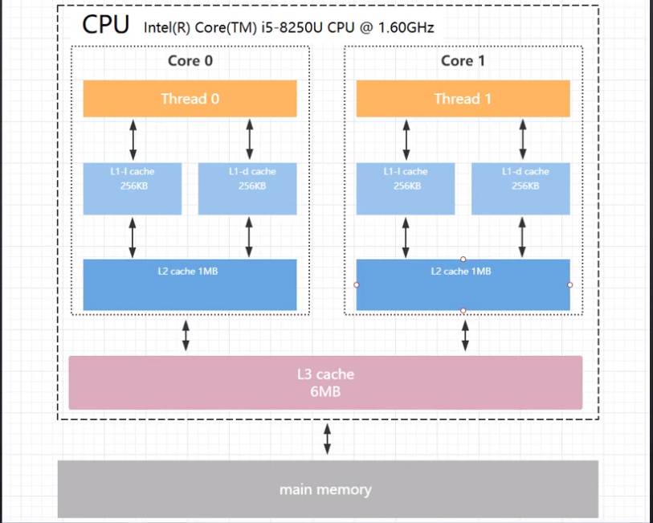
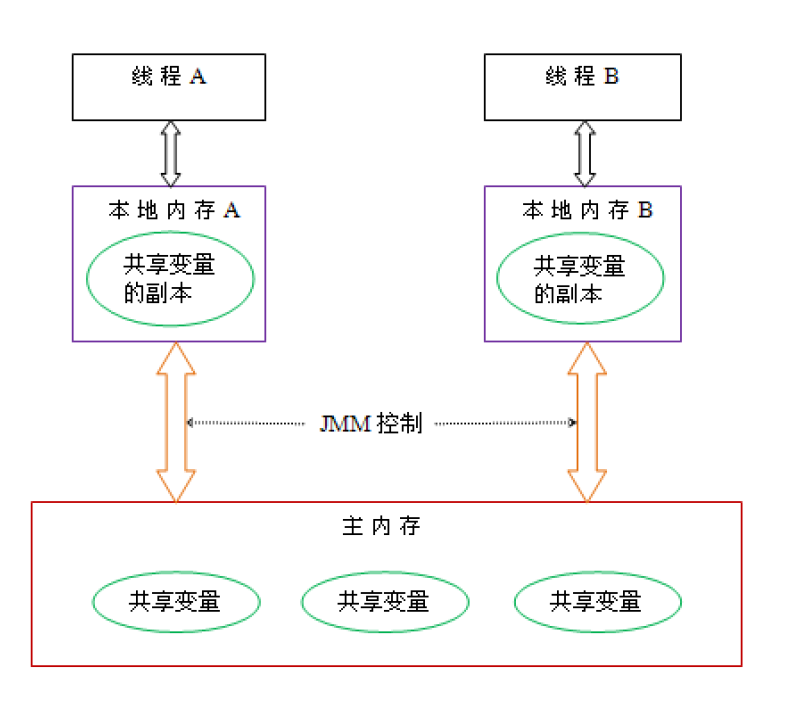

内存模型，和线程模型

程序并发中的问题：
1. 缓存一致性（CPU,寄存器，内存之间的告诉缓存区）问题导致可见性问题
2. 处理器优化导致原子性问题
3. 指令重排序(为了使处理器内部的运算单元尽量被充分利用)导致有序性问题

参考： http://ifeve.com/java-memory-model-1/    

在谈到内存模型的时候，常常会牵扯到线程之间的通信，和线程之间数据的同步。 通行机制有一下两种     
### **并发编程模型分类：**
1. 共享内存模型：（java并发采用的内存模型）
    线程之间贡献程序的公共状态，线程之间通过写-读内存中的公共状态来隐式的进行通行
2. 消息传递并发模型：
    线程之间没有公共的状态，线程之间必须通过明确的发送消息来显示的进行通信

同步是指程序用于控制不同线程之间操作发生的相对顺序的机制

### **java内存模型**
****
**内存可见性问题**  

局部变量(Local Varialbes),方法定义参数(Formal method parameters) 和异常处理器参数（Exception Handler parameters） 不会在线程之间共享，不会出现内存可见性问题
实例域（堆内存中），静态域（方法区）中的数据会再线程之间共享，会出现内存可见性问题  
****
**内存模型（JMM）**     

java线程之间数据共享是通过java内存模型(JMM)控制的。JMM决定了一个线程对共享变量的写入何时对另一个线程可见，从抽象的角度来看，JMM定义了线程和主内存之间的抽象关系         

java内存模型的目标就是为了定义程序中各种变量之间的访问规则

JMM 规定了：    
线程之间的共享变量存储在主内存中（Main Memory）中。每个线程之间都有一个私有的本地内存（Local Memory），
本地内存中存储了该线程以以读写共享变量的副本，线程对变量的所有操作(读取和赋值）都是在Local memory进行的，而不能直接读写主内存中的变量。本地内存其实并不存在，它涵盖 了缓存、写缓冲区、寄存器以及其他的硬件编译器优化

>需要注意的是，这里说的主内存和本地内存其实和java内存区域（堆，栈，方法区等）没有必然关系

线程之间的通信如图  

内存之间的交互操作（虚拟机必须保证这之中的美中操作都是原子的） 

上面讲了JMM对线程之间的通信的规定，它还对指令重排序做了相关的规定，也就是说我们的程序可能会被乱序执行，但是没关系，但是没关系，
只要我们满足happens-before,那么我们的程序就会按照我们的期望执行（JVM层屏蔽了某些处理器的重排序）

happen before 主要是针对于当前的JVM内存模型，为了提高执行效率，可能会对我们书写的代码进行重排序，但是某些情况下是不会冲排序的，也就是满足happen-before原则的代码
**happen before 8原则**
1. 程序次序规则：一个线程内，按照代码顺序，书写在前面的操作先行发生于书写在后面的操作；
2. 锁定规则：在监视器锁上的解锁操作必须在同一个监视器上的加锁操作之前执行。
3. volatile变量规则：对一个变量的写操作先行发生于后面对这个变量的读操作；
4. 传递规则：如果操作A先行发生于操作B，而操作B又先行发生于操作C，则可以得出操作A先行发生于操作C；
5. 线程启动规则：Thread对象的start()方法先行发生于此线程的每一个动作；
6. 线程中断规则：对线程interrupt()方法的调用先行发生于被中断线程的代码检测到中断事件的发生；
7. 线程终结规则：线程中所有的操作都先行发生于线程的终止检测，我们可以通过Thread.join()方法结束、Thread.isAlive()的返回值手段检测到线程已经终止执行；
8. 对象终结规则：一个对象的初始化完成先行发生于他的finalize()方法的开始；

****
**重排序**  

如果指令会重排序，那么我们如何写出满意的代码，

**happen-before**
happen-before八个原则