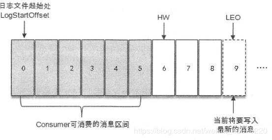
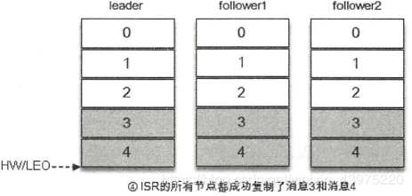
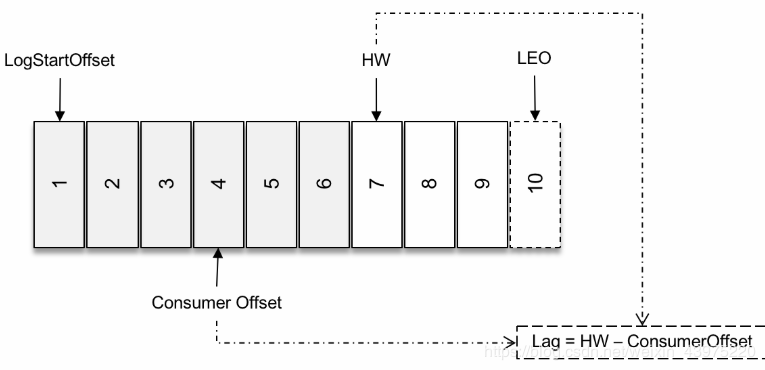
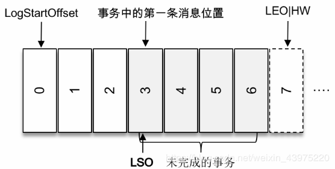
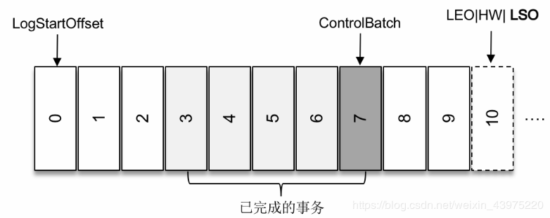

<!-- TOC -->

- [Kafka的用途有哪些？使用场景如何？](#kafka的用途有哪些使用场景如何)
- [Kafka中的ISR、AR又代表什么？ISR的伸缩又指什么？HW、LEO、LSO、LW等分别代表什么？](#kafka中的israr又代表什么isr的伸缩又指什么hwleolsolw等分别代表什么)
- [Kafka中是怎么体现消息顺序性的](#kafka中是怎么体现消息顺序性的)
- [Kafka中的分区器、序列化器、拦截器是否了解？它们之间的处理顺序是什么？](#kafka中的分区器序列化器拦截器是否了解它们之间的处理顺序是什么)
- [Kafka生产者客户端中使用了几个线程来处理？分别是什么](#kafka生产者客户端中使用了几个线程来处理分别是什么)
- [Kafka的旧版Scala的消费者客户端的设计有什么缺陷？](#kafka的旧版scala的消费者客户端的设计有什么缺陷)
- [“消费组中的消费者个数如果超过topic的分区，那么就会有消费者消费不到数据”这句话是否正确？如果不正确，那么有没有什么hack的手段？](#消费组中的消费者个数如果超过topic的分区那么就会有消费者消费不到数据这句话是否正确如果不正确那么有没有什么hack的手段)
- [消费者提交消费位移时提交的是当前消费到的最新消息的offset还是offset+1?](#消费者提交消费位移时提交的是当前消费到的最新消息的offset还是offset1)

<!-- /TOC -->

#### Kafka的用途有哪些？使用场景如何？

kafka目前在项目中的应用主要是这两个部分：

1. 数据异步处理

   wpm中，为了削锋（双11的时候数据量很大的情况下）将部分上游分发的数据通过kafka来异步处理。

2. 日志存储

   每次App调用后台接口产生的日志数据都放到一个队列中，然后有一个每隔一秒的心跳监控着这个队列，如果队列中有数据，将将队列中的数据发送到kafka,在另外的一个专门的日志服务中消费这个kafka的数据，写到操作日志表中，方便后期查询


#### Kafka中的ISR、AR又代表什么？ISR的伸缩又指什么？HW、LEO、LSO、LW等分别代表什么？  
1. **AR,ISR **

**分区中的所有副本统称为`AR（Assigned Repllicas）`。所有与leader副本保持一定程度同步的副本（包括Leader）组成`ISR（In-Sync Replicas）`，ISR集合是AR集合中的一个子集。**

消息会先发送到leader副本，然后follower副本才能从leader副本中拉取消息进行同步，同步期间内follower副本相对于leader副本而言会有一定程度的滞后。前面所说的"一定程度"是指可以忍受的滞后范围，这个范围可以通过参数进行配置。与leader副本同步滞后过多的副本（不包括leader）副本，组成OSR(Out-Sync Relipcas),由此可见：`AR=ISR+OSR`。在正常情况下，所有的follower副本都应该与leader副本保持一定程度的同步，即`AR=ISR,OSR`集合为空。   

 ​ Leader副本负责维护和跟踪ISR集合中所有的follower副本的`滞后状态`，当follower副本落后太多或者失效时，leader副本会把它从ISR集合中`剔除`。如果OSR集合中follower副本"追上"了Leader副本，之后在ISR集合中的副本才有资格被选举为leader，而在OSR集合中的副本则没有机会（这个原则可以通过修改对应的参数配置来改变）

 2. **ISR的伸缩：**

 ​ Kafka在启动的时候会开启两个与ISR相关的定时任务，名称分别为`isr-expiration`和"`sr-change-propagation`.。isr-expiration任务会周期性的检测每个分区是否需要缩减其ISR集合。这个周期和"`replica.lag.time.max.ms`"参数有关。大小是这个参数一半。默认值为5000ms，**当检测到ISR中有是失效的副本的时候，就会缩减ISR集合**。如果某个分区的ISR集合发生变更， 则会将变更后的数据记录到ZooKerper对应/brokers/topics//partition//state节点中。节点中数据示例如下：
 ```json
 {
   "controller_epoch":26,
   "leader":0,
   "version":1,
   "leader_epoch":2,
   "isr":[0,1]
 }
```

 ​ 其中`controller_epoch`表示的是当前的kafka控制器epoch,leader表示当前分区的leader副本所在的broker的id编号，version表示版本号，（当前版本固定位1），leader_epoch表示当前分区的leader纪元，isr表示变更后的isr列表。

 ​ 除此之外，当`ISR集合发生变更`的时候还会将变更后的记录缓存到`isrChangeSet`中，`isr-change-propagation`任务会周期性（固定值为2500ms）地检查isrChangeSet，如果发现isrChangeSet中有ISR 集合的变更记录，那么它会在Zookeeper的**`/isr_change_notification`**的路径下创建一个以isr_change开头的持久顺序节点（比如/isr_change_notification/isr_change_0000000000), 并将isrChangeSet中的信息保存到这个节点中。kafka控制器为**`/isr_change_notification`**添加了一个Watcher，当这个节点中有子节点发生变化的时候会触发Watcher动作，以此通知控制器更新相关的元数据信息并向它管理的broker节点发送更新元数据信息的请求。最后删除**`/isr_change_notification`**的路径下已经处理过的节点。频繁的触发Watcher会影响kafka控制器，zookeeper甚至其他的broker性能。为了避免这种情况，kafka添加了指定的条件，当检测到分区ISR集合发生变化的时候，还需要检查一下两个条件：

 ​ （1）.上一次ISR集合发生变化距离现在已经超过5秒，

 ​ （2）.上一次写入zookeeper的时候距离现在已经超过60秒。

 ​ 满足以上两个条件之一者可以将ISR写入集合的变化的目标节点。

 ​ 有缩减就会有补充，那么kafka何时扩充ISR的？

 ​随着follower副本不断进行消息同步，follower副本LEO也会逐渐后移，并且最终赶上leader副本，此时follower副本就有资格进入ISR集合，追赶上leader副本的判定准侧是此副本的LEO是否小于leader副本HW，这里并不是和leader副本LEO相比。ISR扩充之后同样会更新ZooKeeper中的`/broker/topics/partition/state`节点和isrChangeSet，之后的步骤就和ISR收缩的时的相同。

>  当ISR集合发生增减时，或者ISR集合中任一副本LEO发生变化时，都会影响整个分区的HW。

 ​ 如下图所示，leader副本的LEO为9，follower副本的LEO为7，而follower2副本的LEO为6，如果判定这三个副本都处于ISR集合中，那么分区的HW为6，如果follower3已经判定失效副本被剥离出ISR集合，那么此时分区HW为leader副本和follower副本中LEO的最小值，即为7.   


3. **kafka中的HW、LEO、LSO、LW等分别代表什么？**

**`LW`是Low Watermark的缩写，俗称"低水位"，代表AR集合中最小的logStartOffset值**，副本的拉取请求（FetchRequest，它有可能触发新建日志分段而旧的的被清理，进而导致logStartoffset的增加）和删除请求（DeleteRecordRequest）都可能促使LW的增长。

 ISR与HW和LEO也有紧密的关系，**`HW`是High Watermak的缩写， 俗称高水位，它表示了一个特定消息的偏移量（offset）**，消费者只能拉取到这个offset之前的消息。

 如下，它代表一个日志文件，这个日志文件中有9条消息，第一消息的offset（LogStartOffset）为0，最后的一条消息offset为8，offset为9的消息用虚线框表示，代表下的一个待写入的消息。日志文件的HW为6.表示消费者只能拉取到offset0至5之间的消息，而offset为6的消息对消费者而言是不可见的。


 ​**`LEO`是Log End Offset的缩写，它表示了当前日志文件中下一条待写入消息的offset**，

如上图offset为9的位置即为当前日志文件LEO,LEO的大小相当于当前日志分区中最后一条消息的offset值加1。分区ISR集合中的每个副本都会维护自身的LEO，而ISR集合中最小的LEO即为分区的HW，对消费这而言只能消费HW之前的消息。

 ​ 如下图，假设某个分区的ISR集合中有三个副本，即一个leader副本和两个follower副本，此时分区的LEO和HW都为3。消息3和消息4从生产者发出之后会被先存入leader副本。

  


在消息写入leader副本之后，follower副本会发送拉取请求来拉取消息3和消息4以进行消息同步。

 在同步过程中，不同的follower副本的同步效率也不尽相同。如下图，在某一时刻follower1完全跟上了leader副本而follower2只同步了消息3，如此leader副本的LEO为5，follower1的LEO为5，Follower2的LEO为4。那么当前分区的HW最小值4，此时消费者可以消费到offset为0-3之间的消息。

 写入消息如下图，所有的副本都成功写入了消息3和消息4，整个分区的HW和LEO为5，因此消费者可以消费offset为4的消息了。




 由此可见,kafka的复制机制不是完全的同步复制，也不是单纯的异步复制，事实上，同步复制要求所有能工作的Follower副本都复制完，这条消息才会被确认为成功提交，这种复制方式影响了性能。而在异步复制的情况下， follower副本异步地从leader副本中复制数据，数据只要被leader副本写入就被认为已经成功提交。在这种情况下，如果follower副本都没有复制完而落后于leader副本，如果突然leader副本宕机，则会造成数据丢失。Kafka使用这种ISR的方式有效的权衡了数据可靠性与性能之间的关系。

**什么是LSO？**

**LSO特指LastStableOffset。它具体与kafka的事务有关**

 ​ 消费端参数——`isolation.level`,这个参数用来配置消费者事务的隔离级别。字符串类型，"read_uncommitted"和"read_committed"，表示消费者所消费到的位置，如果设置为"read_committed"，那么消费这就会忽略事务未提交的消息，即只能消费到`LSO(LastStableOffset)`的位置，默认情况下，"`read_uncommitted`",既可以消费到`HW（High Watermak）`的位置。

注：follower副本的事务隔离级别也为"read_uncommitted"，并且不可修改。

 在开启kafka事务的同时，生产者发送了若干消息，（msg1，msg2，）到broker中，如果生产者没有提交事务（执行CommitTransaction），那么对于isolation.level=read_committed的消费者而言是看不多这些消息的，而isolation.level=read_uncommitted则可以看到。事务中的第一条消息的位置可以标记为firstUnstableOffset（也就是msg1的位置）。

 这个LSO还会影响到kafka消费之后的量，(也就是kafka,Log,很多时候也称之为kafka堆积量)的计算 。如下图。


​ 

 在图中，对每一个分区而言，它Lag等于HW-ConsumerOffset的值，其中ComsmerOffset表示当前的消费的位移，当然这只是针对普通的情况。如果为消息引入了事务，那么Lag的计算方式就会有所不同。

如果当消费者客户端的isolation.level的参数配置为"read_uncommitted"（默认），那么Lag的计算方式不受影响，如果这个参数配置为"read_committed",那么就要引入LSO来进行计算了。





 对于未完成的事务而言，LSO的值等于事务中的第一条消息所在的位置，（firstUnstableOffset）

 对于已经完成的事务而言，它的值等同于HW相同，所以我们可以得出一个结论：LSO≤HW≤LEO




 所以，对于分区中未完成的事务，并且消费者客户端的isolation.level参数配置为"read_committed

"的情况，它对应的Lag等于LSO-ComsumerOffset的值。

  

#### Kafka中是怎么体现消息顺序性的
Kafka不保证所有消息都有序，保证的是当前分区内的消息游戏

可以通过分区策略体现消息顺序性。
 分区策略有`轮询策略`、`随机策略`、按`消息键保序策`略。

按消息键保序策略：一旦消息被定义了 Key，那么你就可以保证同一个 Key 的所有消息都进入到相同的分区里面，由于每个分区下的消息处理都是有顺序的，故这个策略被称为按消息键保序策略


```java
List<PartitionInfo> partitions = cluster.partitionsForTopic(topic);
return Math.abs(key.hashCode()) % partitions.size();
```


#### Kafka中的分区器、序列化器、拦截器是否了解？它们之间的处理顺序是什么？


- 序列化器：生产者需要用序列化器（Serializer）把对象转换成字节数组才能通过网络发送给 Kafka。而在对侧，消费者需要用反序列化器（Deserializer）把从 Kafka 中收到的字节数组转换成相应的对象。
- 分区器：分区器的作用就是为消息分配分区。如果消息 ProducerRecord 中没有指定 partition 字段，那么就需要依赖分区器，根据 key 这个字段来计算 partition 的值。
- Kafka 一共有两种拦截器：**生产者拦截器和消费者拦截器**。
  - 生产者拦截器既可以用来在消息发送前做一些准备工作，比如按照某个规则过滤不符合要求的消息、修改消息的内容等，也可以用来在发送回调逻辑前做一些定制化的需求，比如统计类工作。
  - 消费者拦截器主要在消费到消息或在提交消费位移时进行一些定制化的操作。

消息在通过 send() 方法发往 broker  的过程中，有可能需要经过拦截器（Interceptor）、序列化器（Serializer）和分区器（Partitioner）的一系列作用之后才能被真正地发往 broker。拦截器（下一章会详细介绍）一般不是必需的，而序列化器是必需的。消息经过序列化之后就需要确定它发往的分区，如果消息  ProducerRecord 中指定了 partition 字段，那么就不需要分区器的作用，因为 `partition`  代表的就是所要发往的分区号。

处理顺序 ：**拦截器->序列化器->分区器**

KafkaProducer 在将消息序列化和计算分区之前会调用生产者拦截器的 onSend() 方法来对消息进行相应的定制化操作。
 然后生产者需要用序列化器（Serializer）把对象转换成字节数组才能通过网络发送给 Kafka。
 最后可能会被发往分区器为消息分配分区。

生产者消费者整体结构图如下


#### Kafka生产者客户端中使用了几个线程来处理？分别是什么
整个生产者客户端由两个线程协调运行，这两个线程分别为`主线程`和 `Sender 线程（发送线程）`。

**主线程**:

​	由 KafkaProducer  创建消息，然后通过可能的拦截器、序列化器和分区器的作用之后缓存到消息累加器（RecordAccumulator，也称为消息收集器）中。

**Sender 线程**:

​	负责从 RecordAccumulator 中获取消息并将其发送到 Kafka 中。

#### Kafka的旧版Scala的消费者客户端的设计有什么缺陷？

老版本的 Consumer Group 把位移保存在 ZooKeeper 中。Apache ZooKeeper  是一个分布式的协调服务框架，Kafka 重度依赖它实现各种各样的协调管理。将位移保存在 ZooKeeper  外部系统的做法，最显而易见的好处就是减少了 Kafka Broker 端的状态保存开销。

ZooKeeper 这类元框架其实并不适合进行频繁的写更新，而 Consumer Group 的位移更新却是一个非常频繁的操作。这种大吞吐量的写操作会极大地拖慢 ZooKeeper 集群的性能

#### “消费组中的消费者个数如果超过topic的分区，那么就会有消费者消费不到数据”这句话是否正确？如果不正确，那么有没有什么hack的手段？

一般来说如果消费者过多，出现了消费者的个数大于分区个数的情况，就会有消费者分配不到任何分区。

开发者可以继承AbstractPartitionAssignor实现自定义消费策略，从而实现同一消费组内的任意消费者都可以消费订阅主题的所有分区：

```java
public class BroadcastAssignor extends AbstractPartitionAssignor{
    @Override
    public String name() {
        return "broadcast";
    }

    private Map<String, List<String>> consumersPerTopic(
            Map<String, Subscription> consumerMetadata) {
//        （具体实现请参考RandomAssignor中的consumersPerTopic()方法）
    }

    @Override
    public Map<String, List<TopicPartition>> assign(
            Map<String, Integer> partitionsPerTopic,
            Map<String, Subscription> subscriptions) {
        Map<String, List<String>> consumersPerTopic =
                consumersPerTopic(subscriptions);
        Map<String, List<TopicPartition>> assignment = new HashMap<>();
           //Java8
        subscriptions.keySet().forEach(memberId ->
                assignment.put(memberId, new ArrayList<>()));
           //针对每一个主题，为每一个订阅的消费者分配所有的分区
        consumersPerTopic.entrySet().forEach(topicEntry->{
            String topic = topicEntry.getKey();
            List<String> members = topicEntry.getValue();

            Integer numPartitionsForTopic = partitionsPerTopic.get(topic);
            if (numPartitionsForTopic == null || members.isEmpty())
                return;
            List<TopicPartition> partitions = AbstractPartitionAssignor
                    .partitions(topic, numPartitionsForTopic);
            if (!partitions.isEmpty()) {
                members.forEach(memberId ->
                        assignment.get(memberId).addAll(partitions));
            }
        });
        return assignment;
    }
}
```

注意组内广播的这种实现方式会有一个严重的问题—默认的消费位移的提交会失效。

#### 消费者提交消费位移时提交的是当前消费到的最新消息的offset还是offset+1?

在旧消费者客户端中，消费位移是存储在 ZooKeeper 中的。而在新消费者客户端中，消费位移存储在 Kafka 内部的主题__consumer_offsets 中。
 当前消费者需要提交的消费位移是offset+1

[下一页](11-20.md)

