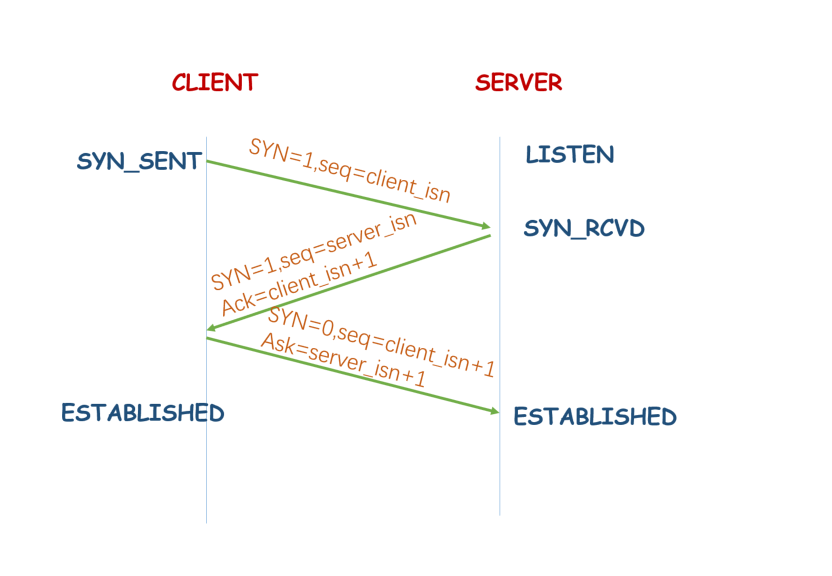

### outline

1. TCP建立连接

    tcp在传输上是`双工传输`，不区分client端和server端，为了便于理解我们把主动发起建链请求的一端称作client端，把被动建立连接的一端称作server端。
    看上面这张图，建联的时序是从上到下，左右两边的蓝色色字分别代表client端与server端当时的链接状态，首先建立链接前需要server端监听端口，因此，server端建立链接前的初始状态就是listen状态，
    这时候client端，准备建立链接，先发送一个SYN同步包，发送完同步包后Client端的链接状态就变成了syn_sent状态。server端收到SYN后，同意建立链接，会向client端回复一个ack。由于TCP双工传输server端也会同时向client端发送一个同步请求SYN=申请server向client方向建立连接，发送完ACK和SYN后，Server端的链接状态就变成了SYN_received。
    client收到server的ack后client端的链接状态就变成了established状态，同时client端向server端发送ack响应，回复server端的syn请求。
    server端收到client端ack后，Server端的链接状态也就变成了established状态此时建立连接完成双方随时可以进行数据传输。
    >需要记住client端和server端的链接状态变化另外回答建联的问题时可以提到syn洪水攻击发生的原因就是server端收到client端的 syn请求后发送ack 和syn，但是client端不进回复。导致server端大量的链接处在syn_RCVD状态进而影响其他正常请求的建立。可以通过设置linux的tcp参数syn_ack_retreat=0来加快半连接的回收速度，或者调大max_syn_backLog来应对少量的SYN洪水攻击
2. TCP断开连接

    TCP链接关闭，通信双方都可以先发起，我们暂且把先发起的一方看做client，
    从图中可以看出，通信中的client和server两端的链接状态都是established状态。然后client端先发起了关闭连接请求，client向server发送了一个SYN包，表示client已经没有数据要发送，
    然后client端就进入了FIN_WAIT1的状态。server端收到SYN后返回ACK然后进入close_wait状态,此时server端属于半关闭状态因为此时client端向server方向已经不会再发送数据了，可是server向client端可能还有数据要发送，等到server端数据发送完毕后Server端会向client端发送FIN表示server端也没有数据要发送。
    这时Server端进入last_ack状态就等待应答就可以关闭链接了，client端收到所有的FIN后回复ack然后进入time_wait状态,time_wait的状态下需要等待两倍的msl(就是最大报文段生存时间)来保证链接的可靠关闭,之后才会进入close状态。
    而server端收到ack后直接就可以进入close状态。
    - 为什么需要等待两倍的MSL之后才能关闭链接?
        1. 要保证TCP协议的全双工链接能够可靠关闭
        2. 要保证这次链接中重复的数据段能够从网络中消失，防止端口被重用的时候可能会产生数据混淆。
    从这个交互流程上可以看出，无论是建立连接还是断连，都是需要在两个方向上进行，只不过建连时，Server端的syn和ack2个包儿合并为一次发送，而断开链接时，两个方向的数据发送的停止时间可能是不同的，所以无法合并fin和ack一起发送，这就是建连的时候必须要三次握手，断连的时候必须要四次的原因。
        
         在回答断连的问题时，可以提到实际应用中有可能会遇到大量socket处在time_wait或者close_wait状态的问题，一般开启Linux的TCP参数tw_reuse和tw_recycle能够加快time_wait状态的回收。而出现大量的close_wait状态，一般是被动关闭地方可能存在代码的bug，没有正确关闭链接导致的。
               
3. Socket交互的基本流程
    socket交互分为这么两个方面
    1. 服务端
    
       **流程** 
        1. 创建socket对象
        2. 绑定Socket和端口号
        3. 监听端口号
        4. 接收来自客户端的请求
        5. 从socket中读取数据
        6. 关闭socket对象
    ```java
    public class Server {   
        private static byte[] bs = new byte[1024];
        public static void main(String[] args) {
            ServerSocket serverSocket = null;
            Socket socket = null;
            try {
                 serverSocket = new ServerSocket(9898);
                while (true) {
   //              阻塞过程
                    socket = serverSocket.accept();
   //                 阻塞过程
                    int read = socket.getInputStream().read(bs);
                    System.out.println(new String(bs));
                }
            } catch (IOException e) {
                e.printStackTrace();
            }finally {
                try {
                    if (serverSocket != null) {
                        serverSocket.close();
                    }
                    if (socket!=null) {
                        socket.close();   
                    }
                } catch (IOException e) {
                    e.printStackTrace();
                }   
            }
        }
    }
     ```   
    2. 客户端
        
        **流程** 
        1. 建立一个socket对象
        2. 连接服务器对应的端口
        3. 发送数据到服务器
        4. 关闭socket对象
     ```java
      public class Client {
          public static void main(String[] args) {
              try (Socket socket = new Socket("127.0.0.1", 9898)) {
                  socket.getOutputStream().write("hello".getBytes());
              } catch (IOException e) {
                  e.printStackTrace();
              }
          }
      }  
     ```  
     需要注意的是，上面分别有客户端和服务端的示例代码，但是并不代表着，socket连接就只有这一种方式，socket连接的方式有很多，但是不论是什么样的连接，都需要遵从以上的连接流程
4. tcp怎么保证有序传输，tcp快速重传和拥塞机制
5. 四七层模型
6. tcp/udp两者之间的定义，
7. time_wait状态，以及其出现的地方和作用
8. udp是不可靠的传输，如果你来设计一个机遇udp差不多可靠的算法，要怎么设计
9. http 和https之间的区别，https解决的问题
10. tcp 和udp如何实现可靠性传输
11. 当我们在访问一个网络后执行的全部过程
12. TCP粘包问题
