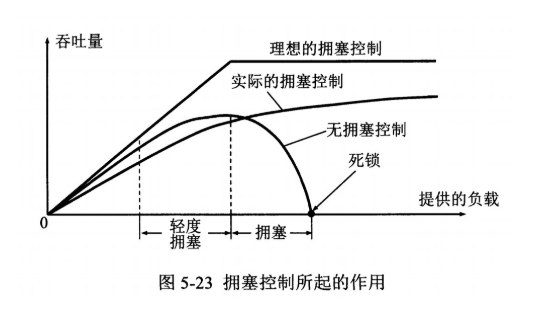
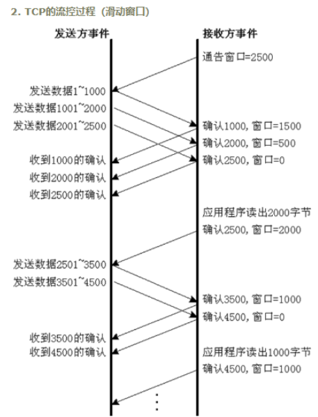
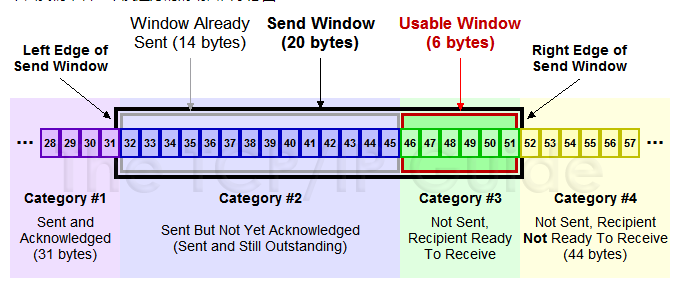
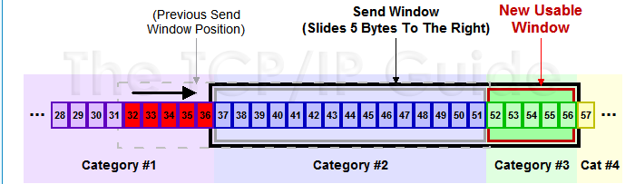

 **tcp怎么保证有序传输，tcp快速重传和拥塞机制**
 
 ##### 校验和：    
 发送的数据包的二进制相加然后取反，目的是检测数据在传输过程中的任何变化。如果收到段的检验和有差错，TCP将丢弃这个报文段和不确认收到此报文段。 
 
##### 确认应答+序列号（累计确认+seq）   
 
 序列号：TCP传输时将每个字节的数据都进行了编号，这就是序列号。 
 确认应答：TCP传输的过程中，每次客户端收到数据后，都会对传输方进行确认应答。也就是发送ACK报文。
 这个ACK报文当中带有对应的确认序列号，告诉发送方，接收到了哪些数据，下一次的数据从哪里发。
 
##### 超时重传：    
 在进行TCP传输时，由于确认应答与序列号机制，也就是说服务端发送一部分数据后，都会等待客户端发送的ACK报文，并解析ACK报文，判断数据是否传输成功。
 如果服务端发送完数据后，迟迟没有等到客户端的ACK报文，这该怎么办呢？而没有收到ACK报文的原因可能是什么呢？
 首先，服务端没有接收到响应的ACK报文原因可能有两点：
 - 数据在传输过程中由于网络原因等直接全体丢包，客户端没有接收到。
 - 客户端接收到了响应的数据，但是发送给服务端的ACK响应报文却由于网络原因丢包了。
 
TCP在解决这个问题的时候引入了一个新的机制，叫做超时重传机制。          
简单理解就是服务端在发送完数据后等待一个时间，时间到达没有接收到ACK报文，那么对刚才发送的数据进行重新发送。
如果是刚才第一个原因，客户端收到二次重发的数据后，便进行ACK应答。
如果是第二个原因，客户端发现接收的数据已存在（判断存在的根据就是序列号，所以上面说序列号还有去除重复数据的作用），那么直接丢弃，仍旧发送ACK应答。

  **那么服务端发送完毕后等待的时间是多少呢？**  
如果服务等待的时间过长，那么会影响TCP传输的整体效率，如果等待时间过短，又会导致频繁的发送重复的包。如何权衡？  
由于TCP传输时保证能够在任何环境下都有一个高性能的通信，因此这个最大超时时间（也就是等待的时间）是动态计算的。
  
超时以`500ms（0.5秒）`为一个单位进行控制，每次判定超时重发的超时时间都是`500ms`的`整数倍`。
重发一次后，仍未响应，那么等待2*500ms的时间后，再次重传。等待4*500ms的时间继续重传。以一个指数的形式增长。
累计到一定的重传次数，TCP就认为网络或者对端出现异常，强制关闭连接。
客户端在接收到数据后，对其进行处理。如果服务端的发送速度太快，导致客户端的结束缓冲区很快的填充满了。此时如果服务端仍旧发送数据，那么接下来发送的数据都会丢包，继而导致丢包的一系列连锁反应，超时重传呀什么的。而TCP根据客户端对数据的处理能力，决定服务端的发送速度，这个机制就是流量控制。
  
简单来说就是客户端处理不过来的时候，就把窗口缩小，并把窗口值告诉服务端。
  在这里只考虑A向B发送数据，假设在连接在建立时，B告诉A:我的接收窗口rwnd=400（receiver window）,不过在报文中已经省略了
  
  如果接收到窗口大小的值为0，那么服务端将停止发送数据。并定期的向客户端发送窗口探测数据段，让客户端把窗口大小告诉服务端。 
 
##### 流量控制：    
 TCP连接的每一方都有固定大小的缓冲空间，TCP的客户端只允许服务端发送客户端缓冲区能接纳的数据。当客户端来不及处理服务端的数据，能提示服务端降低发送的速率，防止包丢失。TCP使用的流量控制协议是可变大小的滑动窗口协议。
 客户端有即时窗口（滑动窗口），随ACK报文发送
 
##### 拥塞控制：    
 当网络拥塞时，减少数据的发送。
 服务端有拥塞窗口，发送数据前比对客户端发过来的即使窗口，按最小的那个值发送
 慢启动、拥塞避免、拥塞发送、快速恢复
 应用数据被分割成TCP认为最适合发送的数据块。 
 TCP的客户端会丢弃重复的数据。 
 如果网络出现拥塞，分组将会丢失，此时服务端会继续重传，从而导致网络拥塞程度更高。因此当出现拥塞时，应当控制服务端的速率。
 这一点和流量控制很像，但是出发点不同。流量控制是为了让客户端能来得及接收，而拥塞控制是为了降低整个网络的拥塞程度。
  
  
  TCP 主要通过四个算法来进行拥塞控制：慢开始、拥塞避免、快重传、快恢复。
  
  慢开始算法原理
   
  服务端需要维护一个叫做拥塞窗口（cwnd）的状态变量，注意拥塞窗口与服务端窗口的区别：拥塞窗口只是一个状态变量，实际决定服务端能发送多少数据的是服务端窗口。
  
  为了便于讨论，做如下假设：
  
      客户端有足够大的接收缓存，因此不会发生流量控制；
      虽然 TCP 的窗口基于字节，但是这里设窗口的大小单位为报文段。
      
        
当TCP连接进行初始化是，将拥塞窗口置为1。

图中的窗口单位不再使用字节而使用报文段。

慢开始门限的初始值设置为16个报文段，即ssthresh=16；

 慢开始和拥塞避免

1.然后开始慢开始算法（指数增长）。当cwnd=16时开始执行拥塞避免算法，呈现线性增长。

2.当拥塞窗口cwnd=24时出现超时，服务端判定为网络拥塞，于是调整门限值ssthresh=cwnd/2=12,同时设置拥塞窗口为1，进入慢开始阶段。

3.按照慢开始算法，服务端每收到一个新报文段的确认ACK拥塞窗口值增加。当cwnd=12时（图中点3）执行拥塞避免算法

快重传和快恢复

4 .当cwnd=16时（图中点4）出现了一个新的情况，就是服务端连续收到3个对统一报文段的重复确认（3-ACK）。服务端执行快重传和快恢复算法。

 

 5 在图中点4，服务端知道只是丢失了个别的报文段，于是不启动慢开始，而是先进行快重传然后执行快恢复算法。

服务端设置调整门限值ssthresh=cwnd/2=8, 同时拥塞窗口cwnd=ssthresh=8（点5），然后进行拥塞避免算法

快重传：收到3个同样的确认就立刻重传，不等到超时；

快恢复：cwnd不是从1重新开始。

 滑动窗口
 
 实际中的传输方式，
 
 需要说明一下，如果你不了解TCP的滑动窗口这个事，你等于不了解TCP协议。
 
 我们都知道，TCP必需要解决的可靠传输以及包乱序（reordering）的问题，
 
 所以，TCP必需要知道网络实际的数据处理带宽或是数据处理速度，这样才不会引起网络拥塞，导致丢包。
 
  
 
  
 
 服务端滑动窗口示意图：
 
  
 
 上图中分成了四个部分，分别是：（其中那个黑模型就是滑动窗口）
 
 1已收到ack确认的数据。
 
 2已发出但还没收到ack的。
 
 3在窗口中还没有发出的（客户端还有空间）。
 
 4窗口以外的数据（客户端没空间） 
注意： 
滑动窗口里是 已发出但未收到ACk、还未发出的 数据

 下面是个滑动后的示意图（收到36的ack，并发出了46-51的字节）：
   
  
  来源：https://www.cnblogs.com/xiaokang01/p/10033267.html