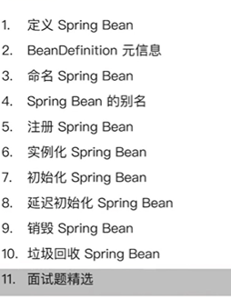
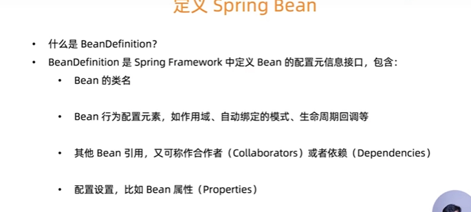
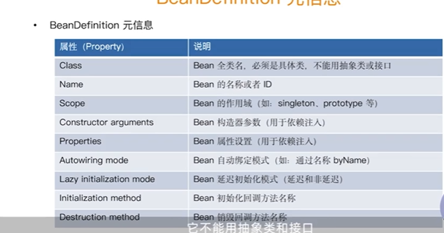

   

#### mysql 

1. 锁实现细节

2. 索引

   ​	相关文章： https://www.cnblogs.com/tgycoder/p/5410057.html

   1. **索引实现**

      1. B-Tree

         **B-Tree中重要的概念**：

         d（B-Tree的度）：度会对约束节点的key和指针的数量，每个非叶子结点由n-1个key和n个指针组成，其中d<=n<=2d；每个叶子结点至少包含一个key和两个指针，最多包含2d-1个key和2d个指针，叶结点的指针均为NULL；

         h（B-Tree的高）：所有叶结点都在同一层，深度等于树高h；

         **B-tree需要满足的条件**：
   
         为了描述B-Tree，首先定义一条数据记录为一个二元组[key, data]，key为记录的键值，对于不同数据记录，key是互不相同的；data为数据记录除key外的数据。那么B-Tree是满足下列条件的数据结构：
         -  d>=2，即B-Tree的度；
         -  h为B-Tree的高；
         -  每个非叶子结点由n-1个key和n个指针组成，其中d<=n<=2d；
         -  每个叶子结点至少包含一个key和两个指针，最多包含2d-1个key和2d个指针，叶结点的指针均为NULL；
         -  所有叶结点都在同一层，深度等于树高h；
         -  key和指针相互间隔，结点两端是指针；
         -  一个结点中的key从左至右非递减排列；
         -  如果某个指针在结点node最左边且不为null，则其指向结点的所有key小于v(key1)，其中v(key1)为node的第一个key的值。
         -  如果某个指针在结点node最右边且不为null，则其指向结点的所有key大于v(keym)，其中v(keym)为node的最后一个key的值。
         -  如果某个指针在结点node的左右相邻key分别是keyi和keyi+1且不为null，则其指向结点的所有key小于v(keyi+1)且大于v(keyi)。
   
      
   
   2. B+Tree（多叉平衡树）
   非叶子节点不存储data,只存储索引（冗余），可以放更多的索引
   叶子节点包含所有的索引字段，
   叶子结点用指针连接，提高区间访问的性能
   `shwo gllobal status like 'innodb_page_size'`: 一个page节点默认大小是16kb
   为什么要设置成16kb?
   将data放到叶子节点，那么非叶子节点中存储的数据可以非常大了.
   想想一个bigint(主键) 是`8byte`，一个指向子节点的内存占用是`6byte`
   也就是说一个索引需要`14b`,所以每个节点能够存放`16kb/14byte=1170`个索引
   假设一个叶子结点的索引和data占用内存为`1kb`,一个B+Tree如果被撑满了，那么能存放的数据为：
   `1170*1170*（16/1)=2190万`
   **InnoDb索引实现（聚簇索引）**
   表数据文件本身就是按照B+Tree组织爱的一个索引结构文件
   聚簇索引-叶节点包含了完整的数据记录
   为什么InnoDb表必须有主键，并且土建使用整型的自增主键
   为什么非主键索引结构叶子结点存储的是主键值（一致性和节省存储空间）
   
   
   
3. **聚簇索引**

      ​	聚簇索引并不是一种单独的索引类型，而是一种数据存储方式，具体细节依赖其实现方式，InnoDB的聚簇索引实际上是在同一个结构中保存了B-Tree索引和数据行。当表有聚簇索引时，它的数据行实际上存放在索引的叶子页（leaf page）中，因为无法同事吧数据行存放在两个不同的地方，所以表中只能有一个聚簇索引（不过覆盖索引可以模拟多个聚簇索引的情况）。InnoDB中默认是通过`主键聚集数据`的，如果没有定义主键，InnoDB会选择一个非空索引代替，如果没有这样的索引，InnoDB会隐式定义一个主键来聚簇索引，

!

1. question:
    索引数据结构
    索引是如何支撑千万级表的快速查询
    如何基于索引B+树精准建立高性能索引
    联合索引底层数据结构又是什么样子的
    mysql 索引优化最佳实践
    
    

#### redis

1. 单线程模型
2. 秒杀系统
3. 缓存穿透，缓存击穿
4. 集群搭建

#### elasticsearch

1. 集群
2. 读写一致
3. bucket Aggregation
4. 脑裂问题

#### kafka

略

#### spring (源码)

#### java8 

https://github.com/itdevbooks/tech

https://gitee.com/geektime-geekbang/geekbang-lessons

GenericTypeResolve   ResolvableType  泛型

IOC容器的职责：
依赖处理：
   依赖查找
   依赖注入
生命周期托管：
   容器的生命周期
   托管的资源
配置：
   容器的配置
   外部化的配置
   托管的资源配置

spring ioc 依赖的来源：
1. 自定义的bean
2. 容器内建依赖
3. 容器内建bean

源信息配置：
   1. bean 定义配置
   2. xml,properties,java注解,java api
BeanFactory 和applicationContext 谁才是真正的 spring ioc 容器？
      DefaultListableBeanFactory
      ConfigurableApplicationContext<- ApplicationContext <- BeanFactory
      ApplicationContext 设计模式是一个代理
      
ApplicationContext 除了Ioc 容器角色以外，还有哪些功能
1. AOP
2. Configuration metadata
3. resources
4. Events
5. i18n
6. annotations
7. Environment Abstraction

#### *beanFactory 与FactoryBean 的区别*
beanFactory 是spring ioc的底层容器
FactoryBean 帮助我们去暴露一个特殊的bean

### spring ioc容器启动的时候做了哪些准备？ 通过功能把 spring 的原理拆解出来。
IOC 配置源信息。 ioc容器生命周期，事件发布，国际化

### 如何定义spring bean 

   

beanDefinition

BeanDefinitionBuilder().build()

   

-------------

tcp/ip 记忆宫殿
1. tcp/ip 高并发负载均衡，集群
2. IO模型 连接如何建议，数据如何传输 ,程序是如何交互的，内核给程序暴露api 源自socket
3. 分布式，微服务，服务网格，大数据，云计算

三次连接 连的是资源，四次分手，分的是连接，释放的是资源
三次连接 确定双方的网络都没有问题

----------
mysql
一条查询语句的执行过程一般是经过连接器、分析器、优化器、执行器等功能模块，最后到达存储引擎。

redo-log(innodb) 保证了当系统崩溃 之前提交的数据也不会丢失 这种能力叫做crash-safe

1. binlog 没有crash-safe能力，是mysql 自带的日志功能
2. redo log 是物理日志，记录的是“在某个数据页上做了什么修改”；binlog 是逻辑日志，记录的是这个语句的原始逻辑，比如“给 ID=2 这一行的 c 字段加 1 ”。
3. redo log 是循环写的，空间固定会用完；binlog 是可以追加写入的。“追加写”是指 binlog 文件写到一定大小后会切换到下一个，并不会覆盖以前的日志。

索引：
二级索引查询的数据仅仅只有主键，不需要回表查询主键索引，这种方式称之为覆盖索引

事务的入口 invokeWithinTransaction  

