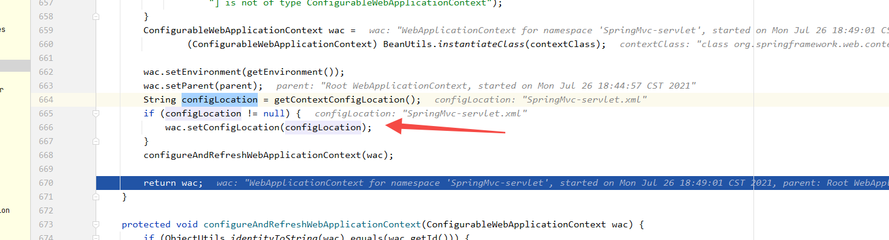
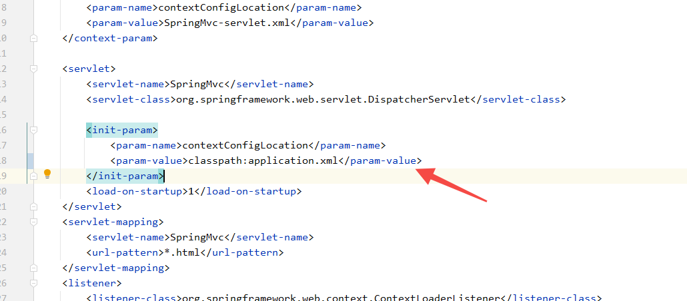

mvc 启动过程
###. web.xml
    1. 加载配置的Listener   ContextLoaderListener
            这个context的作用很简单就是当Tomcat 启动后创建应用程序的上下文，和servletsContext,这个时候的上下文里面其实什么都没有，就是一个空壳子（这一步非必须），
            在下一步创建上下文Context的时候就会把在listener中创建的context作为servlet init()中创建的context的父context. 
            //todo 为什么要这么做?

    2. 加载配置的Servlet    DispatcherServlet
        找刚才创建的上下文，如果找到了，会将刚才的那个上下文作为当前上下文的父上下文，(合并 envirment,目前看到的是这些)
        如果没有找到，那么就创建一个对应的上下文，然后往上下文中塞数据，但是需要塞进去的数据时从哪儿来的，找到这个confiLocation,如下图，默认是 SpringMvc-servlet.xml ，

        当然咯，这个配置的路径我们是可以在web.xml中修改的
        

        已经有了上下文，是不是可以将IOC 和AOP的那些bean给初始化一下，执行下面代码
        this.configureAndRefreshWebApplicationContext(wac);
        自动注入的代码也注入了，接下来，spring mvc 的一些处理器是不是可以初始化一下了
         FrameworkServlet#onRefresh()    
        刚才说的往上下文中方的数据又哪些，其实我们需要考虑web的几个场景

        1. 上传文件
        2. 页面跳转ModelView
        3. 直接restful 形式的数据
        4. cookie 
        5. 国际化等
        这些功能怎么支持的呢？都是童工处理器来支持的，DispatcherServlet#initStrategies(ApplicationContext context) 

   
###. 基于java代码
###. spring-boot 内置tomcat启动过程
    基于spring-boot启动的 mvc项目的顺序会和原生的mvc项目有些不一样，但是整体的逻辑还是一样的。