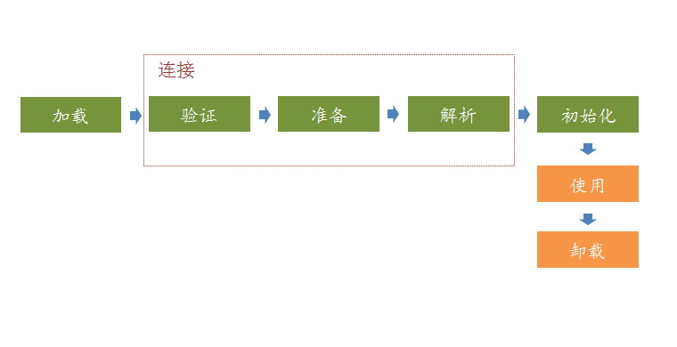

### 类加载过程



类的生命周期：

装载--->  连接（验证，准备，解析） -----> 初始化---->(对象的生命周期(对象实例化，使用，垃圾回收，对象终结)) -----> 卸载

**预处理**：
   1. 通过(前端编译器)编译器，将源代码编译成机器识别的字节码(.class)
   2. 通过类加载器，将字节流加载到内存中，供程序使用     

**类加载的过程**
 1. 加载：虚拟机完成三件事
    1. 通过类名获取类的二进制字节流，将字节流的内容转存到方法区
    2. 转化为特定的数据结构，初步校验常量池，cafebaby文件长度
    3. 在内存中生成一个Class对象作为该方法区数据的访问入口(创建对应类的java.Class实例)
 2. 验证：
    验证加载的这个类是否合法（final是否合规，类型是否准确，静态变量是否合理等）
 3. 准备：
    为静态变量在方法区分配内存，并设置零值
 4. 解析：把常量池中的符号引用解析为直接引用。根据符号引用所作的描述，在内存中找到符合描述的目标并把目标指针返回，完成内存布局(**连接阶段的各项详细操作就看书吧，这里只是做一个总结**)
 5. 初始化：
    执行`<clinit>()`方法，之前静态变量设置的零值初始化为程序员设定的值。  
    注意： 
      - 并不是所有的类都有`<clinit>()`方法。类`<clinit>()`方法是由类变量的赋值动作，和静态语句块(static和static{})中的的代码合并的。
      - 虚拟机会保证子类的`<clinit>()`执行之前，一定会执行父类的`<clinit>()`
      - 虚拟机会保证一个类的`<clinit>()`在多线程环境中被正确的加锁、同步。          

   >记住我们这里谈到的都是类的初始化方法，这个和`<init>()`还是有区别的， `<init>()`方法是对象的初始化方法，一般是在对象创建的时候调用，包括new()关键字，调用Class或者java.lang.reflect.Constructor方法的或者当前对象的clone()方法的时候，当然执行<init>()之前是需要惊醒类初始化的，那么类初始化还没有进行，那么会马上进行类初始化

 6. 使用
 7. 卸载    

**触发类加载的条件**  
1. `遇到new(使用new实例化对象)`、`getstatic(读取类的静态字段)`、`putstatic(设置类的静态字段)`、`invokestatic(调用类的静态方法)`，这四条字节码指令时，如果类没有进行初始化，则需要触发其初始化（其它过程当然在类初始化之前）
2. 使用java.lang.reflect包的方法对类进行反射调用的时候，如果没有初始化，则会初始化
3. 如果初始化的过程发现其父类还没有初始化，
4. 虚拟机启动的时候首先初始化主类(包含main())
5. 使用动态语言(java.lang.invoke.MethodHandle)支持的时候,最后解析结果为`REF_getStatic`、`REF_putStatic`、`REF_invokeStatic`的时候，如果一个类还没有初始化的时候那么就会执行类的初始化


### 类加载器

> 对于任意一个类，都需要由加载它的类加载器和这个类本身一同确立其在java虚拟机中的唯一性，
#### 双亲委派模式
**类加载器**   
  
如上图，类加载器有这样几种 BootStrapClassLoader, ExtensionClassLoader,ApplicationClassLoader, 用户自定义ClassLoader。

`Bootstrap ClassLoader`： 引导类加载器，从%JAVA_RUNTIME_JRE%/lib目录加载，但并不是将该目录所有的类库都加载，它会加载一些符合文件名称的，例如：rt.jar,resources.jar等。在sun.misc.Launcher源码中也可以看得它的加载路径：

```java
private static String bootClassPath = System.getProperty("sun.boot.class.path");
```
或者配置-Xbootclasspath参数指定加载的路径，通过获取环境变量sun.boot.class.path看一下到底具体加载了那些类：

`Extension ClassLoader`：扩展类加载器，实现类为sun.misc.Launcher$ExtClassLoader，加载%JAVA_RUNTIME_JRE%/lib/ext/目录下的jar包，也可以在sun.misc.Launcher源码中也可以看得它的加载路径：
```java 
String s = System.getProperty("java.ext.dirs");
```
通过获取java.ext.dirs环境变量打印一下：
```
D:\Program Files\Java\jdk1.7.0_67\jre\lib\ext
```
`Appication ClassLoader`(由AppClassLoader实现)：应用程序类加载器，或者叫系统类加载器，实现类为sun.misc.Launcher$AppClassLoader。从sun.misc.Launcher的构造函数中可以看到，当AppClassLoader被初始化以后，它会被设置为当前线程的上下文类加载器以及保存到Launcher类的loader属性中，而通过ClassLoader.getSystemClassLoader()获取的也正是该类加载器(Launcher.loader)。应用类加载器从用户类路径中加载类库，可以在源码中看到：
```java
final String s = System.getProperty("java.class.path");
```
java类加载器在加载类时，有如下这么几个过程


1. 先把这个请求委托给自己的父类加载继续执行，如果父类加载器还是在负责加载起，就继续向上委托，直到顶层的启动类加载器。

2. 如果父类加载器能够完成类的加载就成功返回，如果父类加载器无法完成加载，那么子加载器才会尝试自己去加载这个类

3. 如果一直到底层的类加载都没有加载到，那么就会抛出异常ClassNotFoundException。

我们可以看看类加载器中`ClassLoader.loadClass()`的加载代码的加载过程：

```java
 protected Class<?> loadClass(String name, boolean resolve)
        throws ClassNotFoundException
    {
        synchronized (getClassLoadingLock(name)) {
            // 首先，查找该类是否已经被加载过了
            Class c = findLoadedClass(name);
            if (c == null) {  //未被加载过
                long t0 = System.nanoTime();
                try {
                    if (parent != null) {  // 父类加载器不为null，则调用父类加载器尝试加载
                        c = parent.loadClass(name, false);
                    } else {   // 父类加载器为null，则调用本地方法，交由启动类加载器加载，所以说ExtClassLoader的父类加载器为Bootstrap ClassLoader
                        c = findBootstrapClassOrNull(name);
                    }
                } catch (ClassNotFoundException e) {
                }
                if (c == null) { //仍然加载不到，只能由本加载器通过findClass去加载
                    long t1 = System.nanoTime();
                    c = findClass(name);
                    // this is the defining class loader; record the stats
                    sun.misc.PerfCounter.getParentDelegationTime().addTime(t1 - t0);
                    sun.misc.PerfCounter.getFindClassTime().addElapsedTimeFrom(t1);
                    sun.misc.PerfCounter.getFindClasses().increment();
                }
            }
            if (resolve) {
                resolveClass(c);
            }
            return c;
        }
    }
```
从代码中看到，如果parent==null，将会由启动类加载器尝试加载，所以扩展类加载器的父类加载器是启动类加载器。

那么JVM为什么需要双亲微拍模式呢？
**好处**
1. 可以避免类的重复加载
2. 避免了Java的核心API被篡改

**什么情况下需要自定义类加载器呢**
1.  隔离加载类

    在某些框架内进行中间件与应用的模块隔离， 把类加载到不
    同的环境。比如， 阿里内某容器框架通过自定义类加载器确保应用中依赖的jar 包不
    会影响到中间件运行时使用的jar 包。
2. 修改类加载方式

    类的加载模型并非强制， 除Bootstrap 外， 其他的加载并
    非一定要引入， 或者根据实际情况在某个时间点按需进行动态加载。
3. 拓展加载源

    比如从数据库、网络，甚至是电视机机顶盒进行加载。
4. 防止源码泄露

    Java 代码容易被编译和篡改，可以进行编译加密。那么类
    加载器也需要自定义，还原力口密的字节码。
#### 破坏双亲委派模式
**双亲委派模式三次被破坏：**
1. 向前兼容
2. 基础类调用用户代码: 比如tomcat的设计，JNDI类加载过程，JDBC类加载过程等
3. 类加载的动态性
